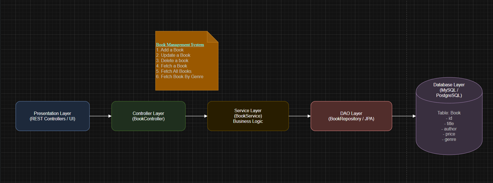

# Chill Book Store

Java book-management project with:
- CLI mode (menu-based flow)
- REST API mode (for the frontend UI)



## Project Structure

```text
src/
  api/            # HTTP API server (REST + CORS)
  controller/     # CLI controller
  dao/            # In-memory datastore
  model/          # POJOs
  presentation/   # CLI input/output
  service/        # Business logic
frontend/
  index.html
  app.js
  styles.css
```

## API Endpoints

Base URL: `http://localhost:8080/api`

- `GET /books`
- `GET /books/{id}`
- `GET /books/genre/{genre}`
- `POST /books`
- `PUT /books/{id}`
- `DELETE /books/{id}`

## CORS

The API sends CORS headers for:
- Origin: `http://localhost:5500`
- Methods: `GET, POST, PUT, DELETE, OPTIONS`
- Header: `Content-Type`

## Run

1. Start backend API:
   Run `BMSMain` with no arguments.

2. Start frontend:

```bash
cd frontend
python -m http.server 5500
```

3. Open `http://localhost:5500`
4. Keep UI Base URL as `http://localhost:8080/api`

## CLI Mode

To run old CLI menu, run `BMSMain` with argument:

```text
cli
```
